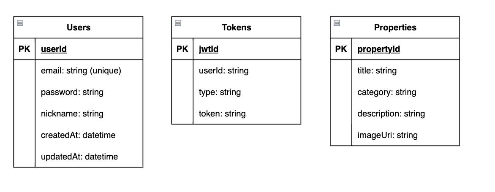
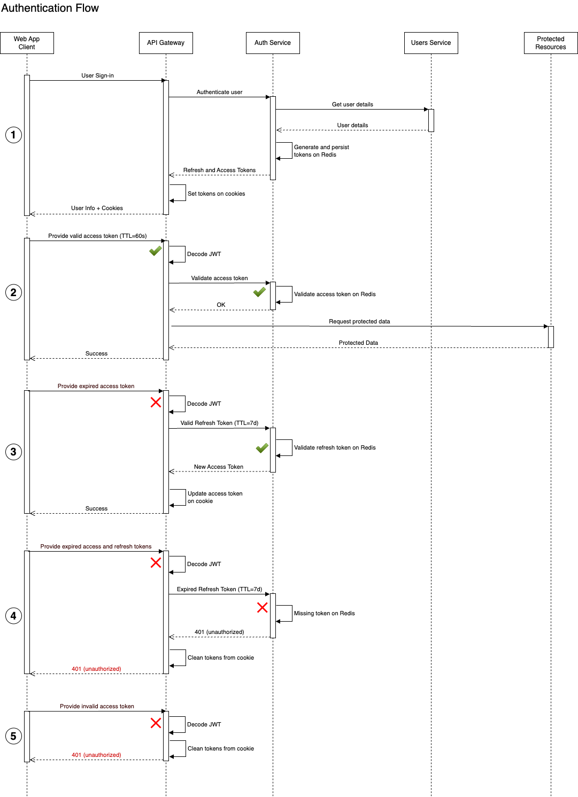
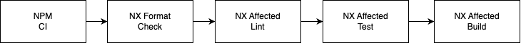
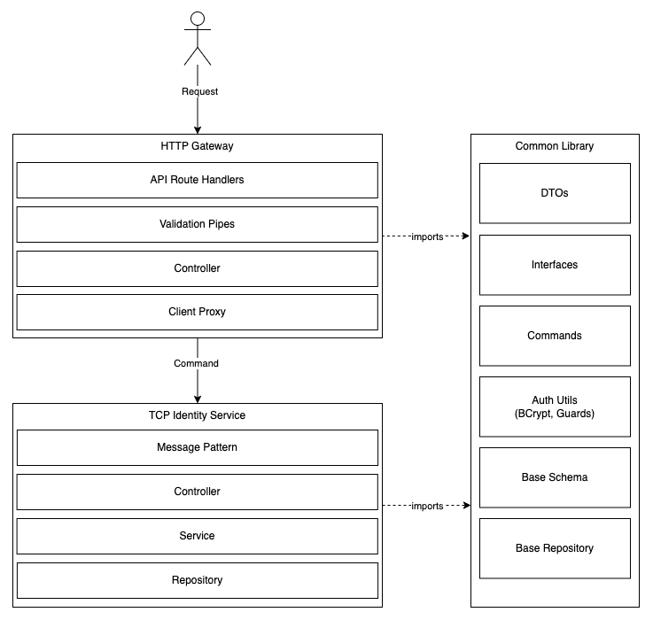

# Property Finder Educational Side Project

## Summary

This is an educational side project where I am trying to replicate a real world marketplace app, like Blocket, Realtor or PropertyFinder, where users can buy and sell used apartments. The idea is to create a very simple initial version of it and iterate over the time adding new features and use cases, documentating the process and enabling discussions about scalability, availability and performance.

### Functional Requirements

- Users can register to create new accounts and use the system
- Users can authenticate in the app using JWT strategy
- Authenticated Sellers can add new properties to the listing
- Buyers can search for existing apartments using plain text or keywords
- Authenticated Buyers can create monitors to specific search keywords
- Buyers should be notified about new properties every 24hs and should never be notified twice about the same property.

### Non-Functional

- User authentication should be safe and reliable
- Low latency on search results
- Eventual consistency of new apartments on search results
- General high availability and scalability

## High-Level System Design


- **Web Server**: Nginx web server responsible about host and delivery the client React web app, it will also cache requests, and apply rate limits to prevent DDoS attacks.
- **API Gateway**: REST API Gatweay to all internal micro services. It is responsible about handling user authentication, validate session and proxy authenticathed api calls to internal services.
- **Identity Service**: Internal service used to Register and Authenticate users.
- **Property Service**: Internal service used to maintain user properties.
- **Search Service**: Internal service used to search by properties in the Elasticsearch index.
- **Keywords Service**: Internal service used to maintain active search keywords monitors.
- **Search-Indexer** Consumer: AMQP service used to consume "new property" events from Kafka and update the search index.
- **Notification Consumer**: AMQP service used to consume "new property" events from Kafka and insert pending notification into a Redis datastore with a TTL.
- **Notification Service**: This service will read the list of pending notifications from Redis and send batches of email notifications.

### API Design

| Method | Endpoint                                | Access    | Description                                                | Return   |
| ------ | --------------------------------------- | --------- | ---------------------------------------------------------- | -------- |
| POST   | /api/v1/accounts/register               | Public    | Register a new user account in the app                     | 200, 4xx |
| POST   | /api/v1/auth/login                      | Public    | Authenticate the user, create cookies and return user info | 200, 401 |
| GET    | /api/v1/auth/me                         | Protected | Validate session and get user info                         | 200, 401 |
| POST   | /api/v1/auth/logout                     | Protected | Logout existing the user, remove cookies                   | 200, 401 |
| POST   | /api/v1/properties                      | Protected | Create a new property                                      | 201, 4xx |
| GET    | /api/v1/properties/`<id>`               | Protected | Return details from a single property                      | 200, 404 |
| PUT    | /api/v1/properties/`<id>`               | Protected | Update one existing property                               | 200, 404 |
| DELETE | /api/v1/properties/`<id>`               | Protected | Delete one existing property                               | 200, 404 |
| GET    | /api/v1/properties/search?q=`<keyword>` | Protected | Full-text search on indexed properties                     | 200      |

### Database Schema



### User Authentication Flow



#### Use cases

1. User Sign-in in the app
2. Authenticated user perform an API call to protected resources using a valid access token
3. Authenticated user perform an API call to protected resources using an expired/invalid access token
4. Authenticated user perform an API call with both Access and Refresh Token expired

## Implementation details

### The Monorepo

### CI & CD

I am using Github Actions with a standard pipeline definition for NX monorepos.
Only CI for now but I have plans to setup the CD at some point to deploy the app to staging and run E2E tests.



### Backend



### Frontend

TBD

### Testing strategy

TBD

### Deployment

TBD

## Local Development

### Start the app

You can run all services by starting the docker-compose

```
docker-compose up
```

### Lint and Tests

```
nx run-many -t lint test
```
